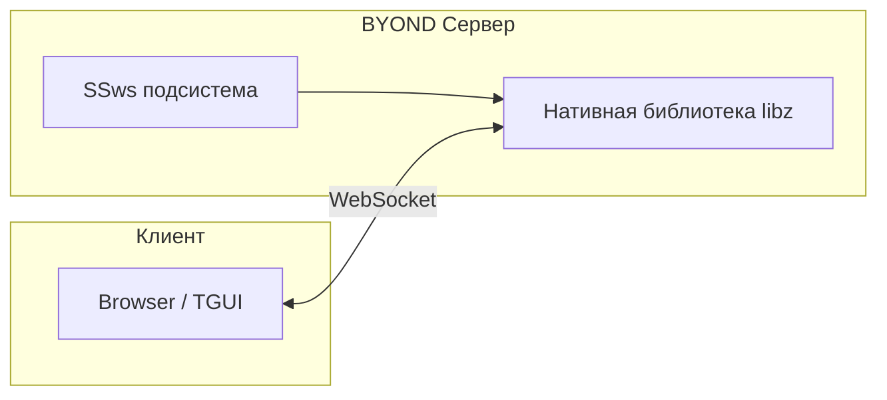
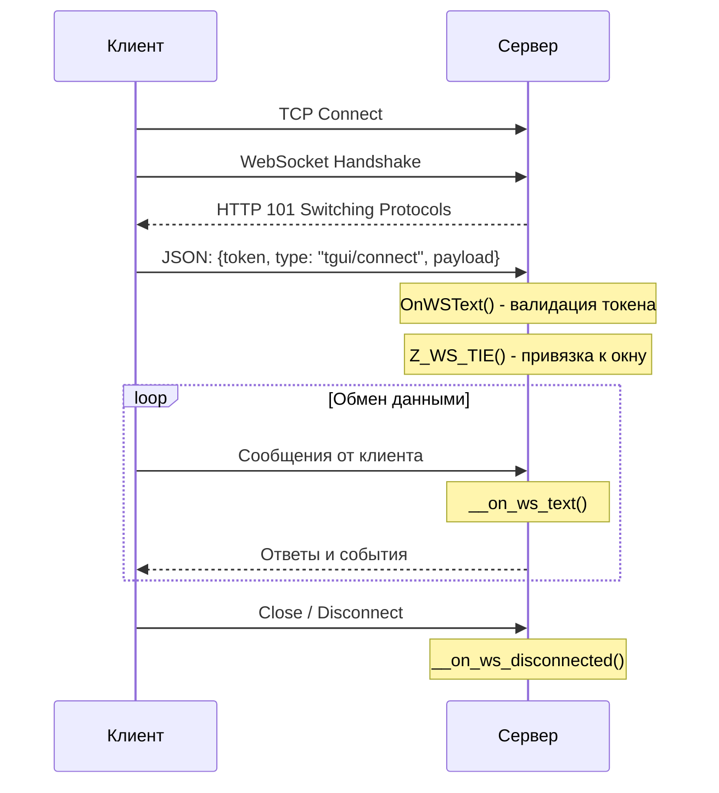
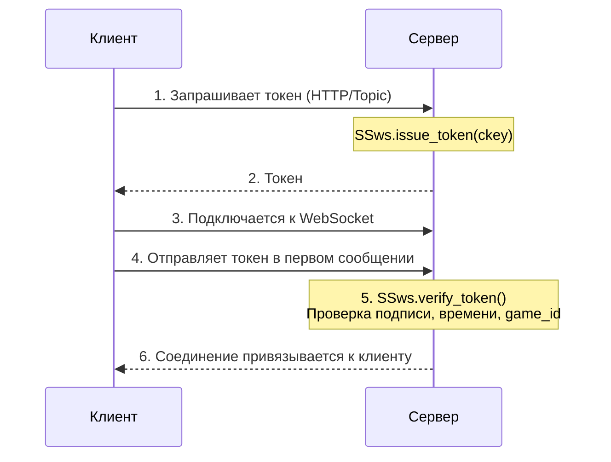

# WebSocket

## Введение

WebSocket - это протокол для двусторонней связи между сервером и клиентом в реальном времени. В отличие от стандартного механизма Topic в BYOND, WebSocket позволяет:

- **Мгновенно** отправлять сообщения в обе стороны
- **Держать постоянное соединение** вместо постоянных запросов
- **Снизить нагрузку** на сервер за счёт отсутствия HTTP-оверхеда
- **Улучшить отзывчивость** интерфейсов TGUI

### Зачем это нужно?

Механизм Topic в BYOND работает через HTTP-подобные запросы. Каждый клик в TGUI - это новый запрос. С WebSocket соединение устанавливается один раз, и дальше данные летают туда-сюда без задержек.

## Архитектура



### Компоненты:

1. **SSws** - подсистема DM, управляет сервером
2. **Нативная библиотека** (libz.dll / liblibz.so) - обрабатывает низкоуровневую работу с сокетами
3. **TGUI Window** - привязывается к соединению для получения сообщений

## Конфигурация

Все параметры задаются в TOML-конфиге в секции `[ws]`:

### Основные параметры

| Параметр | Тип | По умолчанию | Описание |
|----------|-----|--------------|----------|
| `secure` | bool | false | Использовать WSS (требует прокси) |
| `host` | string | - | Публичный адрес для WSS (например, "ss13.ru:3508") |
| `port` | number | 0 | Порт сервера. 0 = автовыбор |

### Лимиты соединений

| Параметр | По умолчанию | Описание |
|----------|--------------|----------|
| `max_connections` | 256 | Максимум одновременных соединений |
| `max_connections_per_ip` | 5 | Соединений с одного IP (0 = без лимита) |

### Таймауты

| Параметр | По умолчанию | Описание |
|----------|--------------|----------|
| `handshake_timeout_ms` | 5000 | Время на рукопожатие WebSocket |
| `idle_timeout_ms` | 300000 | Таймаут неактивности (5 минут) |
| `ping_interval_ms` | 30000 | Интервал отправки ping |
| `pong_timeout_ms` | 10000 | Ожидание pong после ping |
| `initial_message_timeout_ms` | 1000 | Время на первое сообщение |
| `afk_timeout_ms` | 0 | AFK-таймаут (0 = выключен) |

### Лимиты размеров

| Параметр | По умолчанию | Описание |
|----------|--------------|----------|
| `max_message_size` | 1048576 | Макс. размер сообщения (1 МБ) |
| `max_frame_size` | 1048576 | Макс. размер фрейма (1 МБ) |
| `max_handshake_size` | 8192 | Макс. размер HTTP-хендшейка |

### Rate limiting

| Параметр | По умолчанию | Описание |
|----------|--------------|----------|
| `rate_limit_messages_per_sec` | 25 | Сообщений в секунду |
| `rate_limit_bytes_per_sec` | 1048576 | Байт в секунду |

### Отладка

| Параметр | По умолчанию | Описание |
|----------|--------------|----------|
| `log` | false | Логировать все сообщения |

## Работа с соединениями

### Жизненный цикл соединения



### Привязка соединения (Tie)

Ключевая концепция: **соединение можно привязать к объекту**.

```dm
// Привязать соединение conn_id к объекту window
Z_WS_TIE(conn_id, window, "on_text_proc", "on_binary_proc", "on_disconnect_proc")
```

После привязки:
- Все текстовые сообщения вызывают `window.on_text_proc()`
- Бинарные сообщения вызывают `window.on_binary_proc()`
- При отключении вызывается `window.on_disconnect_proc()`

### Отправка сообщений

```dm
// Отправить текст
Z_WS_SEND(conn_id, "Hello, client!")

// Отправить JSON
Z_WS_SEND(conn_id, json_encode(list("type" = "update", "data" = mydata)))

// Отправить бинарные данные (список байтов)
Z_WS_SEND(conn_id, list(0x48, 0x65, 0x6C, 0x6C, 0x6F))
```

### Отключение

```dm
// Принудительно отключить клиента
Z_WS_DISCONNECT(conn_id)
```

> **Важно:** Нельзя вызывать `Z_WS_DISCONNECT` внутри колбэков `on_text`/`on_binary`. Вместо этого верните `FALSE` из колбэка - соединение закроется автоматически.

## Аутентификация через токены

### Формат токена

```
SIGNATURE;CKEY;GAME_ID;WORLD_TIME
```

Пример:
```
a1b2c3d4e5f6...;someplayerckey;abc123;12345
```

### Как это работает



### Безопасность

- Секретный ключ (`GLOB.ws_secret`) генерируется при первом запросе токена
- Используется криптографически стойкий HMAC-SHA256
- Токен действует только 60 секунд
- Токен привязан к конкретной игре (`game_id`)

## Интеграция с TGUI

WebSocket заменяет механизм Topic для TGUI-окон.

### Как подключается TGUI

```dm
/proc/tgui_WSConnect(list/content, addr, conn_id, client/client)
```

Эта процедура вызывается когда клиент отправляет:
```json
{
    "token": "...",
    "type": "tgui/connect",
    "payload": {
        "window_id": "1"
    }
}
```

Затем, если токен корректный - соединение "связывается" с соответствующим объектом окна, и все последующие сообщения пойдут напрямую к нему:

```dm
/datum/tgui_window/proc/__on_ws_text(content, addr, conn_id)
```
